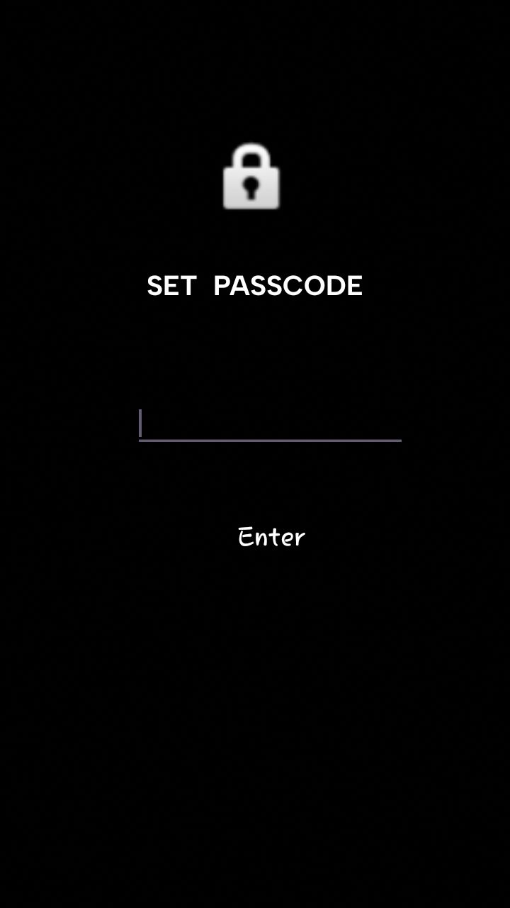

# My Journal

**My Journal** is an Android application designed to help you keep track of your thoughts and daily activities. It features a user-friendly interface, secure password protection, and uses Room database for reliable data storage.

## Features

- **Password Protection**: The app ensures that only authorized users can access their journals.
- **Room Database**: Journal entries are stored in a local Room database, which guarantees data persistence, reliable storage, and easy retrieval.
- **Create,Edit and Delete Entries**: create new journal entries, edit existing ones and Remove journal entries that are no longer needed.
- **Search Functionality**: Quickly find specific journal entries by searching for titles or keywords within the journal content.
- **User-Friendly Interface**: The app features a clean and straightforward design, making it easy to write, manage, and navigate your journal entries.

## App Preview

Here are some screenshots of the app in action:

### Opening Page

### Home Screen

### Writing Page

### Journals List

### Setting a Password

### Searching for a journal

